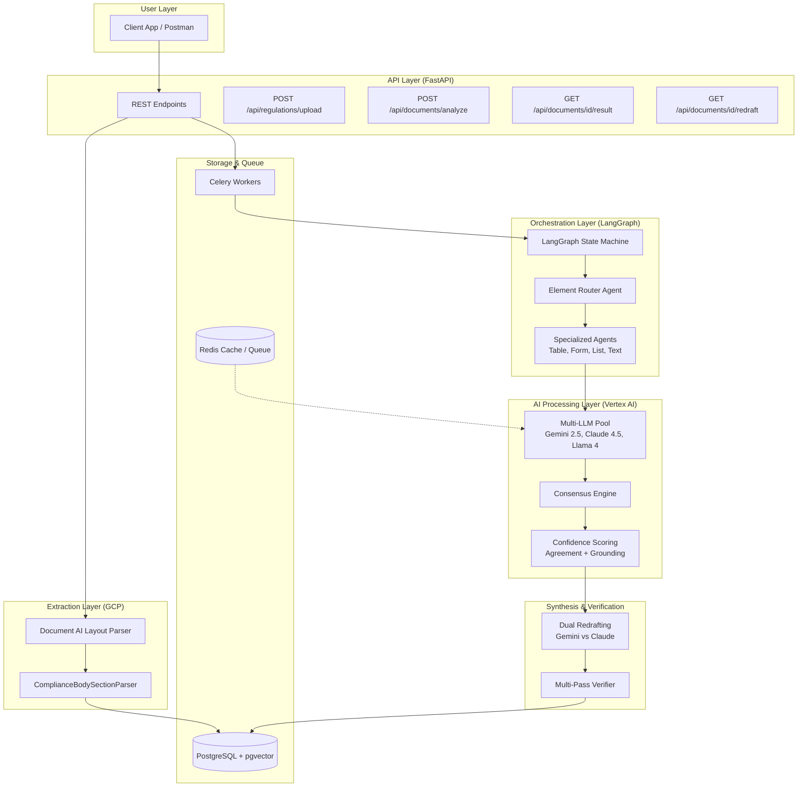

# High-Performance Multi-LLM RAG Analysis Service - System Architecture

This document provides a comprehensive overview of the end-to-end system design, integrating extraction, orchestration, multi-LLM consensus, and localized output generation.

## 1. High-Level Flow Diagram

## 2. Component Breakdown

### A. Extraction Layer (Google Document AI)

- **Layout Parser**: Identifies semantics (tables, sections, forms).
- **Coordinate Mapping**: Preserves `boundingPoly` and `normalizedVertices` for visual grounding.
- **Structural Parser**: Uses regex-based logic to handle Standard/Legal (MHRS) vs. Hierarchical (CARF) numbering.

### B. Orchestration Layer (LangGraph)

- **Stateful Memory**: Tracks element processing, intermediate findings, and consensus status.
- **Element Routing**: Dynamically assigns sub-tasks to agents specialized in tabular data, form logic, or narrative text.
- **Fault Tolerance**: Implements PostgreSQL checkpointers for job recovery.

### C. Multi-LLM Consensus Layer (Vertex AI Model Garden)

- **Diversity**: Parallel processing via **Gemini 2.5 Pro**, **Claude Opus 4.5**, and **Llama 4**.
- **Consensus Engine**: Semantic clustering of findings to eliminate hallucinations.
- **Confidence Formula**: Weighted score (50% Agreement, 30% Grounding, 10% Citation, 10% Consistency).
- **Threshold**: Strict $\ge 0.90$ for automated inclusion.

### D. Synthesis & Verification Layer

- **Dual Redrafting**: Generates compliant text using both Gemini and Claude, selecting based on a third-party "Quality Scorer" LLM.
- **Final Consensus**: A second round of multi-LLM verification on the finalized document to ensure zero drift.

## 3. API & Output Definitions

### Primary Endpoints

- `POST /api/regulations/upload`: Ingests reference manuals.
- `POST /api/documents/analyze`: Starts asynchronous document analysis.
- `GET /api/documents/{id}/result`: Returns structured JSON findings.
- `GET /api/documents/{id}/redraft`: Returns the enhanced document (Word/HTML/PDF).

### Color-Coded Redrafting (Default)

- **Black**: Unchanged original text.
- **Blue**: In-line modifications.
- **Red**: New insertions/entries.

### Analysis Report Structure (Default: DOCX)

- **PART 1: SUMMARY OF ANALYSIS**: Grouped findings by standard heading (e.g., "1.L. ACCESSIBILITY") with summaries of issues.
- **PART 2: DETAILED ANALYSIS BREAKDOWN**:
  - **Black**: Actual section text from standard manual.
  - **Red**: Identified gaps/issues.
  - **Blue**: Theraptly's suggested remediations.

## 4. Performance Metrics

- **Parallelism**: Asynchronous model inference across 3+ flagship LLMs.
- **Reliability**: Consensus matching reduces hallucination rates in regulatory contexts.
- **Traceability**: All claims linked to source coordinates in original PDF/DOCX.
