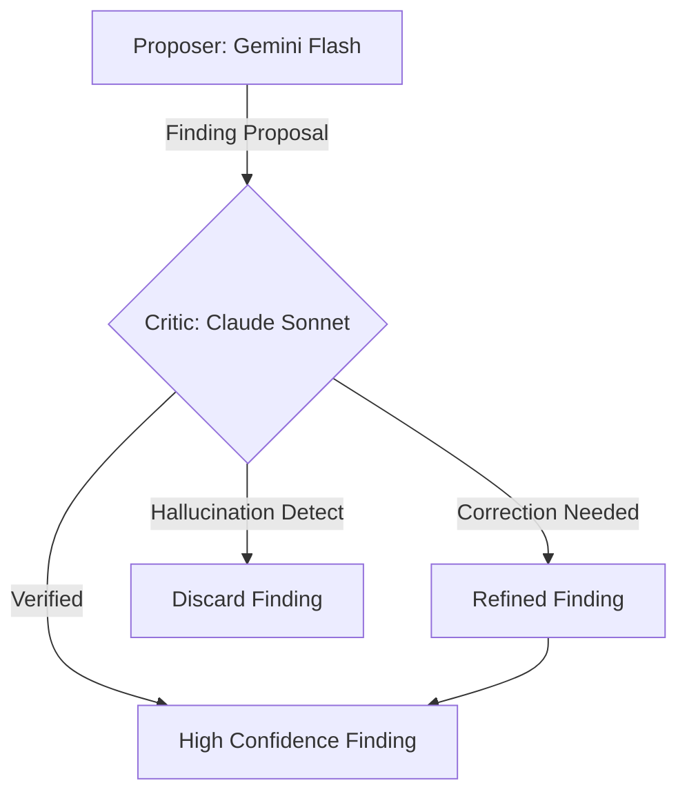

# WORK PLAN: Advanced Compliance Analysis & Critique System

This document outlines the strategic improvements for the multimodal-analyzer, focusing on precision, traceability, and a robust critique-driven validation loop.

## 1. Increased Confidence Thresholds

To minimize false positives and ensure authoritative compliance reports, the system will implement stricter confidence gates.

- **High Confidence Gate**: 0.95 (Definitive findings).
- **Medium Confidence Gate**: 0.80 (Findings requiring manual review).
- **Rationale**: High thresholds force the critique system to resolve ambiguities before a finding is categorized as "High Confidence."

## 2. Recursive Error-Centric Analysis (The Second Pass)

Instead of re-analyzing the entire document, the second pass deep-dives into identified gaps.

- **Unique Error ID**: Every finding is assigned a persistent UUID (e.g., `err-001`).
- **Targeted Context**: The LLM is provided only with the specific document snippet and the regulation reference for validation.
- **Persistent Tracking**: Errors can be tracked throughout the document's lifecycle using these unique IDs.

## 3. Targeted Conflict Resolution

Users or the system can trigger a deep-dive check on a single specific conflict or finding.

- **Validity Check**: Running a dedicated "Judge" prompt on a single conflict to resolve discrepancies between models.
- **Deep Proofing**: Leveraging high-cost models (e.g., Claude 3.5 Sonnet) specifically for these isolated checks.

## 4. Multi-LLM Critique System (Core Pillar)

A "Check and Balance" system where every finding is cross-examined.

- **The Proposer**: Scans and identifies potential gaps (e.g., Gemini 1.5 Flash).
- **The Critic**: Reviews the proposal, checks evidence, and validates against the regulation (e.g., Claude 3.5 Sonnet).
- **The Refiner**: If the critic finds issues, the finding is either discarded or improved based on the feedback.

### Critique Workflow Diagram

## 5. Well-Formatted Output

The final analysis reports will follow a structured formatting standard:

- **Tracing**: Each finding includes its Unique Error ID and a critique trail.
- **Color Coding**:
  - **Black**: Actual requirement from compliance manual.
  - **Red**: Identified gaps in the document.
  - **Blue**: Specific recommendations for remediation.
- **Executive Summary**: Grouped by regulation section for quick triage.
